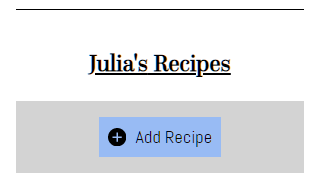

# Recipeak

A friendly recipe app.

Created by Alex Fukui for Thinkful.

[Github](https://github.com/psychicbologna/recipeak-client)
[Demo](https://recipeak-client.now.sh/)

This project was bootstrapped with [Create React App](https://github.com/facebook/create-react-app).

## Summary

Recipeak's primary function is to store your favorite recipes in one place. You can add, edit and delete these recipes and their components. The server was designed to use a database with associated tables for users, recipes, units and ingredients.

To learn more about the backend functionalities, see the [API documentation](https://github.com/psychicbologna/recipeak-api/blob/master/README.md).

### How to Use

1. Create an account or sign in using the demo account `bonappetite` with the password `password`.

2. Try adding your favorite recipe! Click the Add Recipe button.

  The form includes a section for listing ingredients, with an 'Add New Ingredient' fieldset.

   Note that unit measurement select is divided into categories, including approximate and US/Metric. Certain unit sets will show a 'Convert x to x' button, which will show you the converted version of that unit.

  
  
   
   When you select the 'Custom' option in unit sets, the fieldset changes so you can define custom unit data.

   

3. Click 'Submit' on the bottom of the screen. You should be directed to the new recipe's view page.

 

  The recipe has also been added your homepage in a card list format. You may click on 'View' or the recipe's title to review it.

4. You can also edit the components of your recipe. Click on the 'Edit' link on the card to bring up an editing version of the recipe form.

5. Note you can edit the list of ingredients by adding new ones, editing existing ones and deleting any ones on the list you don't need anymore.

7. Finally, you can delete the recipe using the 'Delete' link under the Submit button on the form. Doing so will permanently remove the recipe from your account!

## Tech Stack

Node, npm, React.js including react-router, react-dom, react-router-dom and react-scripts.

Testing: Enzyme

Logging: Mocha

## Available Scripts

In the project directory, you can run:

### `npm start`

Runs the app in the development mode. 
Open [http://localhost:3000](http://localhost:3000) to view it in the browser.

The page will reload if you make edits. 
You will also see any lint errors in the console.

### `npm test`

Launches the test runner in the interactive watch mode. 
See the section about [running tests](https://facebook.github.io/create-react-app/docs/running-tests) for more information.

### `npm run build`

Builds the app for production to the `build` folder. 
It correctly bundles React in production mode and optimizes the build for the best performance.

The build is minified and the filenames include the hashes. 
Your app is ready to be deployed!

See the section about [deployment](https://facebook.github.io/create-react-app/docs/deployment) for more information.

### `npm run eject`

**Note: this is a one-way operation. Once you `eject`, you can’t go back!**

If you aren’t satisfied with the build tool and configuration choices, you can `eject` at any time. This command will remove the single build dependency from your project.

Instead, it will copy all the configuration files and the transitive dependencies (Webpack, Babel, ESLint, etc) right into your project so you have full control over them. All of the commands except `eject` will still work, but they will point to the copied scripts so you can tweak them. At this point you’re on your own.

You don’t have to ever use `eject`. The curated feature set is suitable for small and middle deployments, and you shouldn’t feel obligated to use this feature. However we understand that this tool wouldn’t be useful if you couldn’t customize it when you are ready for it.

## Learn More

You can learn more in the [Create React App documentation](https://facebook.github.io/create-react-app/docs/getting-started).

To learn React, check out the [React documentation](https://reactjs.org/).

### Code Splitting

This section has moved here: https://facebook.github.io/create-react-app/docs/code-splitting

### Analyzing the Bundle Size

This section has moved here: https://facebook.github.io/create-react-app/docs/analyzing-the-bundle-size

### Making a Progressive Web App

This section has moved here: https://facebook.github.io/create-react-app/docs/making-a-progressive-web-app

### Advanced Configuration

This section has moved here: https://facebook.github.io/create-react-app/docs/advanced-configuration

### Deployment

This section has moved here: https://facebook.github.io/create-react-app/docs/deployment

### `npm run build` fails to minify

This section has moved here: https://facebook.github.io/create-react-app/docs/troubleshooting#npm-run-build-fails-to-minify